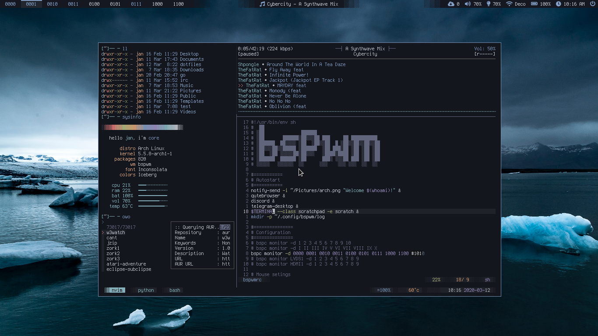

```
      ██            ██     ████ ██  ██
     ░██           ░██    ░██░ ░░  ░██
     ░██  ██████  ██████ ██████ ██ ░██  █████   ██████
  ██████ ██░░░░██░░░██░ ░░░██░ ░██ ░██ ██░░░██ ██░░░░
 ██░░░██░██   ░██  ░██    ░██  ░██ ░██░███████░░█████
░██  ░██░██   ░██  ░██    ░██  ░██ ░██░██░░░░  ░░░░░██
░░██████░░██████   ░░██   ░██  ░██ ███░░██████ ██████
 ░░░░░░  ░░░░░░     ░░    ░░   ░░ ░░░  ░░░░░░ ░░░░░░

  ▓▓▓▓▓▓▓▓▓▓
 ░▓ about  ▓ custom linux config files
 ░▓ author ▓ Cherrry9 <cherrry9@disroot.org>
 ░▓ code   ▓ https://github.com/Cherrry9/dotfiles
 ░▓▓▓▓▓▓▓▓▓▓
 ░░░░░░░░░░

```

## table of contents
 - [introduction](#dotfiles)
 - [managing](#managing)
 - [installing](#installing)
 - [how it works](#how-it-works)
 - [tl;dr](#tldr)
 - [previews](#previews)
 - [license](#license)

# dotfiles
in the unix world programs are commonly configured in two different ways, via shell arguments or text based configuration files. programs with many options like window managers or text editors are configured on a per-user basis with files in your home directory `~`. in unix like operating systems any file or directory name that starts with a period or full stop character is considered hidden, and in a default view will not be displayed. thus the name dotfiles. 

it's been said of every console user: 
> _"you are your dotfiles"_.

since they dictate how your system will look and function. to many users (see [ricers](http://unixporn.net) and [beaners](http://nixers.net)) these files are very important, and need to be backed up and shared. people who create custom themes have the added challenge of managing multiple versions of them. i have tried many organization techniques. and just take my word for it when i say, keeping a git repo in the root of your home directory is a bad idea. i've written custom shell scripts for moving or symlinking files into place. there are even a few dotfile managers, but they all seem to have lots of dependencies. i knew there had to be a simple tool to help me.

# managing
i manage mine with [gnu stow](http://www.gnu.org/software/stow/), a free, portable, lightweight symlink farm manager. this allows me to keep a versioned directory of all my config files that are virtually linked into place via a single command. this makes sharing these files among many users (root) and computers super simple. and does not clutter your home directory with version control files.

# installing
stow is available for all linux and most other unix like distributions via your package manager.

- `sudo pacman -S stow`
- `sudo apt-get install stow`
- `brew install stow`

or clone it [from source](https://savannah.gnu.org/git/?group=stow) and [build it](http://git.savannah.gnu.org/cgit/stow.git/tree/INSTALL.md) yourself.

# how it works
by default the stow command will create symlinks for files in the parent directory of where you execute the command. so my dotfiles setup assumes this repo is located in the root of your home directory `~/dotfiles`. and all stow commands should be executed in that directory. otherwise you'll need to use the `-d` flag with the repo directory location.

to install most of my configs you execute the stow command with the folder name as the only argument. 

to install my **bspwm** config use the command:

`stow bspwm`

this will symlink files to `~/.config/bspwm` and various other places.

but you can override the default behavior and symlink files to another location with the `-t` (target) argument flag. 

to install **scripts** for root you need to execute the command:

`stow -t /root scripts` 

this will symlink the file to `/root/.local/bin`.

**note:** stow can only create a symlink if a config file does not already exist. if a default file was created upon program installation you must delete it first before you can install a new one with stow. this does not apply to directories, only files.

# tl;dr
navigate to your home directory

`cd ~`

clone the repo:

`git clone http://github.com/Cherrry9/dotfiles`

enter the dotfiles directory

`cd dotfiles`

install the shell settings

`stow shell`

install zsh settings for the root user

`sudo stow shell -t /root`

install neovim configuration

`stow nvim`

uninstall neovim configuration

`stow -D nvim`

install bspwm

`stow bspwm`

etc, etc, etc...

# previews



# license


all files and scripts in this repo are released [CC0](https://creativecommons.org/publicdomain/zero/1.0/) / [kopimi](https://kopimi.com)! in the spirit of _freedom of information_, i encourage you to fork, modify, change, share, or do whatever you like with this project! `^c^v`
